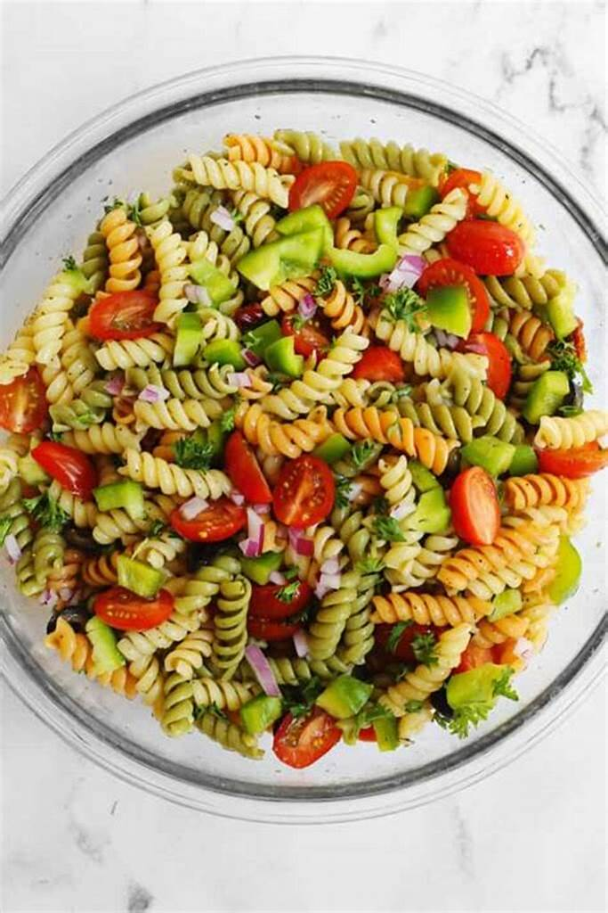

# Introducción al desarrollo Front-end
En este módulo, conocerá los diferentes tipos de desarrolladores web y las funciones y responsabilidades de los desarrolladores front-end, back-end y full-stack. Echará un primer vistazo a las tecnologías básicas de HTML, CSS y Javascript y explorará los conceptos que sustentan el funcionamiento de Internet.

# Primer proyecto del curso
# Little Lemon - Menú y Ubicación

Este proyecto HTML representa un sitio web simple para "Little Lemon", un lugar ficticio. A continuación, se presenta un resumen de los códigos utilizados en los archivos:

## `index.html` - Menú

```html
<!DOCTYPE html>
<html>
    <head>
        <title> Little Lemon </title>
    </head>
    <body>
        <h1> Our Menu </h1>
        <h2> Falafel </h2>
        <p> Chickpea, herbs and spices</p>
        <h2> Pasta Salad </h2>
        <p> Lettuce, vegetables and mozzarella </p>
        <a href="location.html"> Our Location </a>
    </body>
</html>
```

En este archivo, se presenta un menú simple con platos como "Falafel" y "Pasta Salad". Se incluye un enlace a la ubicación del establecimiento.

## `location.html` - Ubicación

```html
<!DOCTYPE html>
<html>
    <head>
        <title> Little Lemon </title>
    </head>
    <body>
        <h1> Our Location </h1>
        <p> 123 Home Road, Main District, Capital City</p>
    </body>
</html>
```

Este archivo detalla la ubicación de "Little Lemon" con la dirección "123 Home Road, Main District, Capital City".

## Resumen de Aprendizaje

En el desarrollo de estos archivos HTML, se aprendieron los siguientes conceptos:

- Uso del `<!DOCTYPE html>` para indicar que se trata de un documento HTML.
- Estructura básica con las etiquetas `<html>`, `<head>`, y `<body>`.
- Utilización de etiquetas de encabezado `<h1>`, `<h2>` para títulos.
- Creación de párrafos con la etiqueta `<p>`.
- Incorporación de enlaces `<a>` para navegar entre páginas.
- Práctica con etiquetas de énfasis `<strong>`, negrita `<b>`, cursiva `<i>`.
- Creación de listas con `<ul>` y `<ol>`.
- Uso de la etiqueta `<div>` como contenedor genérico.

Estos son solo algunos de los conceptos básicos de HTML cubiertos en este proyecto. Se recomienda revisar las lecciones adicionales y los códigos en mención para obtener más información sobre el desarrollo web con HTML.

# Actualización: Little Lemon - Menú, Ubicación y Más

## `index.html` - Menú y Más

```html
<!DOCTYPE html>
<html>
    <head>
        <title> Little Lemon </title>
    </head>
    <body>
        <h1> Our Menu </h1>
        <h2> Falafel </h2>
        <p> Chickpea, herbs and spices</p>
        
        <h2> Pasta Salad </h2>
        <p> Lettuce, vegetables and mozzarella </p>
         <br>
        <a href="location.html"> Our Location </a> <br>

        <style>
            table, th, td{
                border: 1px solid black;
                border-collapse: collapse;
            }    
        </style>
        <table>
            <tr>
                <th> Dishes </th>
                <th> Price </th>
            </tr>
            <tr>
                <td> Falafel </td>
                <td> $10.00 </td>
            </tr>
            <tr>
                <td> Past Salad </td>
                <td> $12.00 </td>
            </tr>
        </table>
    </body>
</html>
```

## Resumen de Aprendizaje Adicional

En este código actualizado, se han incluido imágenes para los platos del menú, así como una tabla que muestra los platos y sus precios. 

- Se utiliza la etiqueta `` para mostrar imágenes de los platos del menú.
- La tabla se ha creado con las etiquetas `<table>`, `<th>` y `<td>` para mostrar información tabular.
- Se ha agregado información adicional sobre el DOM y su papel en la manipulación dinámica de documentos HTML.
- Se ha introducido información sobre formularios en HTML y su importancia para la recopilación de datos del usuario.

### DOM (Modelo de Objetos del Documento)

El DOM (Modelo de Objetos del Documento) es una interfaz de programación que proporciona una representación estructurada y jerárquica de un documento. Este documento suele ser un documento HTML o XML, y el DOM permite a los programas o scripts modificar la estructura, el estilo y el contenido del documento de manera dinámica. En el contexto de HTML, el DOM representa la estructura de la página web, permitiendo la manipulación mediante lenguajes como JavaScript.

El DOM organiza el documento en un árbol de nodos, donde cada elemento del documento es un nodo. Los nodos pueden representar etiquetas HTML, atributos, texto, entre otros. Los programadores utilizan el DOM para acceder, modificar y actualizar elementos y atributos del documento HTML, creando así interactividad dinámica en las páginas web.

### Formularios en HTML

Los formularios en HTML son una parte esencial de la interacción del usuario en la web. Permiten a los usuarios ingresar y enviar datos al servidor web. Un formulario puede contener diversos elementos, como campos de texto, casillas de verificación, botones de radio, botones de envío, entre otros.

Algunos elementos clave en la creación de formularios en HTML incluyen:

- `<form>`: Define un formulario y encierra todos los elementos del formulario.
- `<input>`: Crea campos de entrada, como campos de texto, casillas de verificación y botones.
- `<select>`: Define una lista desplegable, también conocida como menú de selección.
- `<textarea>`: Permite a los usuarios ingresar texto en un área de texto de múltiples líneas.
- `<button>`: Crea botones dentro del formulario.

Cuando un usuario completa y envía un formulario, los datos se envían al servidor web para su procesamiento. Los formularios son fundamentales para la recopilación de información y la interacción bidireccional entre los usuarios y las aplicaciones web.

#CSS
CSS, o Cascading Style Sheets, es un lenguaje de diseño utilizado para controlar la presentación y el estilo de un documento HTML. Permite separar la estructura de un documento web de su diseño, facilitando así la gestión y modificación de la apariencia de una página sin tener que cambiar su contenido.

### Sintaxis Básica de CSS:
La sintaxis básica de CSS consiste en reglas que definen cómo se debe presentar un elemento HTML. Una regla CSS típica tiene la siguiente estructura:

```css
selector {
    propiedad: valor;
}
```

- **Selector:** Especifica a qué elementos HTML se aplicará la regla.
- **Propiedad:** Atributo que se va a cambiar (como color, tamaño, márgenes, etc.).
- **Valor:** Valor que se asigna a la propiedad.

### Ejemplos:

1. **Cambiar el color del texto:**

```css
/* Selecciona todos los párrafos y cambia el color del texto a rojo */
p {
    color: red;
}
```

2. **Establecer el fondo de la página:**

```css
/* Cambia el fondo de toda la página a gris claro */
body {
    background-color: #f2f2f2;
}
```

3. **Estilizar un encabezado:**

```css
/* Cambia el color y el tamaño del texto del encabezado h1 */
h1 {
    color: blue;
    font-size: 24px;
}
```

4. **Diseñar una lista:**

```css
/* Agrega márgenes y estilo a las listas desordenadas */
ul {
    margin: 10px;
    list-style-type: square;
}
```

5. **Estilo de enlaces:**

```css
/* Cambia el color y quita el subrayado de los enlaces */
a {
    color: #0066cc;
    text-decoration: none;
}
```

6. **Aplicar bordes a las imágenes:**

```css
/* Agrega un borde a todas las imágenes */
img {
    border: 2px solid #ddd;
}
```

7. **Diseñar tablas:**

```css
/* Estiliza las celdas y encabezados de tabla */
table {
    border-collapse: collapse;
    width: 100%;
}

th, td {
    border: 1px solid #ddd;
    padding: 8px;
    text-align: left;
}
```

```html
<!DOCTYPE html>
<html>
<!--
Selectores de elementos

El selector de elementos permite a los desarrolladores 
seleccionar elementos HTML basándose en su tipo de elemento.
Por ejemplo, si utilizas como selector, la regla se aplicará 
a todos los elementos <p> de la página web.
HTML:
<p>Once upon a time...</p>
<p>In a hidden land...</p>
CSS:
p { 
  color: blue; 
}

Selectores ID

El selector ID utiliza el atributo id de un elemento HTML. 
Dado que el id es único dentro de una página web, permite 
al desarrollador seleccionar un elemento específico para 
estilizarlo. Los selectores ID llevan como prefijo el 
carácter #.
HTML:
<span id="latest"> New! </span>
CSS:
#latest { 
  background-color: purple; 
}

Selectores de clase

Los elementos también pueden seleccionarse en función del 
atributo de clase que se les aplique. La regla CSS se ha 
aplicado a todos los elementos con el nombre de clase 
especificado. El selector de clase lleva como prefijo el 
carácter ..
En el siguiente ejemplo, la regla CSS se aplica a ambos 
elementos, ya que tienen aplicada la clase CSSnavigation.
HTML:
<a class="navigation">Go Back</a>
<p class="navigation">Go Forward</p>
CSS:
.navigation { 
  margin: 2px;
}

Elemento con selector de clase

Un método más específico para seleccionar elementos HTML 
consiste en seleccionar primero el elemento HTML y después 
la clase CSS o ID.
El ejemplo siguiente selecciona todos los elementosp que 
tienen aplicada la clase CSSintroduction.
HTML:
<p class="introduction"></p>
CSS:
p.introduction { 
  margin: 2px;
}

Selectores descendientes

Los selectores descendientes son útiles si necesita 
seleccionar elementos HTML que están contenidos dentro 
de otro selector.
Exploremos un ejemplo.
Usted tiene la siguiente estructura HTML y regla CSS.
HTML:
<div id="blog">
  <h1>Latest News</h1>
  <div>
    <h1>Today's Weather</h1>
    <p>The weather will be sunny</p>
  </div>
  <p>Subscribe for more news</p>
</div>
<div>
  <h1>Archives</h1>
</div>
CSS:
#blog h1 {
  color: blue;
}
La regla CSS seleccionará todos los elementosh1 que estén 
contenidos dentro del elemento con el IDblog. La regla CSS 
no se aplicará al elementoh1 que contiene el textoArchives.
La estructura de un selector descendiente es un selector CSS, 
seguido de un único carácter de espacio, seguido de otro 
selector CSS.
También se pueden seleccionar varios descendientes. Por 
ejemplo, para seleccionar todos los elementosh1 que sean 
descendientes de elementosdiv que sean descendientes del 
elementoblog, el selector se especifica de la siguiente manera.
CSS:
#blog div h1 {
  color: blue;
}

Selectores hijos

Los selectores hijos son más específicos que los selectores 
descendientes. Sólo seleccionan elementos que son 
descendientes inmediatos (hijos) de un selector (el padre).
Por ejemplo, usted tiene la siguiente estructura HTML:
HTML:
<div id="blog">
  <h1>Latest News</h1>
  <div>
    <h1>Today's Weather</h1>
    <p>The weather will be sunny</p>
  </div>
  <p>Subscribe for more news</p>
</div>
Si desea aplicar estilo al elementoh1 que contiene el 
texto Latest News, puede utilizar el siguiente selector hijo:
CSS:
#blog > h1 {
  color: blue;
}
Esto seleccionará el elemento con el IDblog(el padre), y 
luego seleccionará todos los elementosh1 que estén contenidos 
directamente en ese elemento (los hijos). La estructura del 
selector hijo es un selector CSS seguido del símbolo 
combinador hijo> seguido de otro selector CSS.
Tenga en cuenta que esto no irá más allá de un único nivel 
de profundidad. Por lo tanto, la regla CSSno se aplicará 
al elementoh1 que contiene el texto Today's Weather.

pseudoclase:hover

Una palabra clave especial denominada pseudoclase permite a 
los desarrolladores seleccionar elementos en función de su 
estado. No se preocupe demasiado por lo que eso significa en 
este momento. Por ahora, veamos cómo la pseudoclase hover 
le permite aplicar estilo a un elemento cuando el cursor del 
ratón pasa por encima del elemento.

El ejemplo más sencillo de esto es cambiar el color de un 
hipervínculo cuando se pasa el ratón por encima. Para ello, 
añada la pseudoclase:hover al final del selector. En el 
siguiente ejemplo, si añade :hover al elemento a cambiará 
el color del hipervínculo a naranja cuando se pase el 
puntero por encima.
CSS:
a:hover {
  color: orange;
}
-->
</html>
```

Este código HTML proporciona ejemplos y explicaciones detalladas sobre diversos selectores CSS, incluyendo selectores de elementos, ID, clase, descendientes, hijos y pseudoclases. Cada sección contiene ejemplos de HTML y reglas CSS, junto con comentarios explicativos.

```html
<!DOCTYPE html>
<html>
<!--
Conceptos básicos de alineación

Alineación de texto

Alinear texto dentro de un elemento HTML es muy sencillo. 
Para ello, se utiliza la propiedad CSS text-align. En el 
siguiente ejemplo, la regla CSS está estableciendo que el 
texto de todos los elementos de párrafo esté alineado al 
centro.
p {
    text-align: center;
}
La alineación del texto puede establecerse en left, right, 
center y justify.
La alineación justify extiende el texto para que cada línea 
del texto tenga la misma anchura.
La alineación por defecto es left para idiomas que son de 
izquierda a derecha como el inglés. Para las lenguas que van 
de derecha a izquierda, como el árabe, la alineación por 
defecto es right.

Alineación de elementos en HTML

La alineación de los elementos HTML es más complicada que la 
del texto. Para alinear elementos HTML, debe tener en cuenta 
el modelo de caja y el flujo del documento de lecciones 
anteriores. La alineación de un elemento HTML se realiza 
cambiando las propiedades de su modelo de caja y cómo afecta 
al flujo del documento.

Alineación central de elementos HTML

Para alinear al centro un elemento, usted establece un ancho 
en el elemento y empuja sus márgenes hacia fuera para llenar 
el espacio disponible restante del elemento padre como en la 
siguiente estructura HTML:
<div class="parent">
  <div class="child">
  </div>
</div>
En su CSS, establecerá que el elemento parent tenga un borde 
rojo para visualizar el espacio que ocupa:
.parent {
  border: 4px solid red;
}
El elemento child tendrá una anchura igual al 50% del elemento 
parent con un relleno de 20 píxeles. Tenga en cuenta que 
padding: 20px es la forma abreviada de establecer el relleno 
superior, inferior, izquierdo y derecho en 20px. Para 
visualizar el espacio que ocupa, establezca el borde en verde:
.child {
  width: 50%;
  padding: 20px;
  border: 4px solid green;
}
Para alinear el elemento al centro, establezca su propiedad 
margin en auto. auto indicará al navegador que calcule 
automáticamente el margen en función del espacio disponible.
.child {
  width: 50%;
  padding: 20px;
  border: 4px solid green;
  margin: auto;
}
El resultado es que el elemento child queda centrado dentro del 
elemento parent:

Es importante señalar que esto funciona porque el elemento div es un elemento a nivel de bloque.  

Si desea alinear un elemento en línea como img, tendrá que cambiarlo
 a un elemento a nivel de bloque. De forma similar al ejemplo de div,
  añada el elemento img a un elemento padre:
<div class="parent">
  
</div>
La regla CSS cambia entonces el elemento img a un elemento a nivel 
de bloque y establece su margen en auto:
.child {
  display: block;
  width: 50%;
  margin: auto;
}
Para ser más precisos, en CSS sólo puede establecer los márgenes 
izquierdo y derecho en automático. Esto le permite establecer los 
márgenes superior e inferior a valores específicos si es necesario.
.child {
  display: block;
  width: 50%;
  margin-left: auto;
  margin-right: auto;
}
Alineación izquierda / derecha de elementos HTML

Las dos formas más comunes de alinear los elementos a izquierda y 
derecha son utilizar la propiedad float y la propiedad position.
La propiedad position tiene varias opciones de valor que influyen 
en cómo se muestra el elemento en el flujo del documento. Más 
adelante veremos cómo utilizar la propiedad position. Por ahora, 
centrémonos en la propiedad float.
La propiedad float establece la posición de un elemento en relación
con el contenido de texto dentro de un elemento padre. El texto se 
envolverá alrededor del elemento.
En el siguiente ejemplo, la imagen se alineará a la derecha del 
elemento div. El contenido de texto se envolverá alrededor de la 
imagen:
HTML
<div class="parent">
   Lorem ipsum dolor sit amet, 
</div>
CSS
.child {
  float: right;
}
-->
</html>
```

Este código HTML proporciona ejemplos y explicaciones detalladas sobre la alineación de texto y elementos en HTML mediante propiedades CSS como `text-align`, `margin`, `padding`, `display`, `float`, y `position`.

Por supuesto, puedo proporcionarte explicaciones detalladas para cada bloque de código que se muestra en el README.md. Aquí está la explicación para cada parte del código:

### Ejercicio 1: Estilizando una página

```css
/* styles.css */

/* Regla para el elemento body */
body {
    background-color: #E0E0E2;
}
```

Esta regla establece el color de fondo del elemento `body` en un tono de gris claro (`#E0E0E2`).

```css
/* Regla para el elemento h1 */
h1 {
    color: #721817;
}
```

Esta regla establece el color del texto para todos los elementos `h1` en un tono de rojo oscuro (`#721817`).

```css
/* Regla para el elemento h2 */
h2 {
    color: #721817;
}
```

Similar a la regla anterior, esta establece el color del texto para todos los elementos `h2` en un tono de rojo oscuro (`#721817`).

```css
/* Regla para la clase center-text */
.center-text {
    text-align: center;
}
```

Esta regla alinea el texto al centro para cualquier elemento que tenga la clase `center-text`.

```css
/* Regla para el elemento con el id logo */
#logo {
    margin-left: auto;
    margin-right: auto;
    display: block;
}
```

Esta regla centra horizontalmente un elemento con el ID `logo` utilizando márgenes automáticos y establece su visualización como bloque.

```css
/* Regla para todos los elementos span dentro de h2 */
h2 span {
    color: #FA9F42;
    font-size: 0.75em;
}
```

Esta regla establece el color y el tamaño de fuente para todos los elementos `span` que son hijos de elementos `h2` en un tono de naranja (`#FA9F42`) y tamaño de fuente del 75% del tamaño normal.

```css
/* Regla para el elemento con el id copyright */
#copyright {
    padding-top: 12px;
    font-size: 0.75em;
}
```

Esta regla establece un relleno en la parte superior y el tamaño de fuente para el elemento con el ID `copyright`.

### Ejercicio 2: Estilizando una página

```html
<!-- index.html -->

<!DOCTYPE html>
<html>
<head>
    <title>Tu Nombre</title>
    <link rel="stylesheet" href="styles.css">
</head>
<body>
    <!-- Contenido del cuerpo aquí -->
</body>
</html>
```

En este archivo HTML, se establece la estructura básica del documento. Se enlaza el archivo CSS `styles.css` y se deja espacio para agregar contenido en el cuerpo más adelante.

```css
/* styles.css */

#photo {
    border: 2px solid blue;
}

h1 {
    color: blue;
}

h2 {
    color: grey;
}

div {
    margin: 4px;
}
```

Estas reglas CSS aplican estilos específicos:
- La imagen con el ID `photo` tendrá un borde azul sólido de 2 píxeles.
- Todos los elementos `h1` tendrán texto de color azul.
- Todos los elementos `h2` tendrán texto de color gris.
- Todos los elementos `div` tendrán un margen de 4 píxeles.

### Ejercicio 3: Crear y estilizar una página web

```html
<!-- index.html -->

<!DOCTYPE html>
<html>
<head>
    <title>Tu Nombre</title>
    <link rel="stylesheet" href="styles.css">
</head>
<body>
    <!-- Contenido del cuerpo aquí -->
</body>
</html>
```

Al igual que en el ejercicio 2, aquí se establece la estructura básica del documento HTML y se enlaza el archivo CSS `styles.css`.

```html
<!-- Contenido del cuerpo (sección de Tarea 1) -->
<div>
    <h1>Tu Nombre</h1>
</div>
<div>
    
</div>
<div>
    <h2>Favorite Music Artists</h2>
    <ul>
        <li>Artista 1</li>
        <li>Artista 2</li>
        <li>Artista 3</li>
        <li>Artista 4</li>
        <li>Artista 5</li>
    </ul>
</div>
<div>
    <h2>Favorite Films</h2>
    <ol>
        <li>Película 1</li>
        <li

>Película 2</li>
        <li>Película 3</li>
        <li>Película 4</li>
        <li>Película 5</li>
    </ol>
</div>
```

Aquí se agrega contenido al cuerpo del documento HTML, incluyendo un título (`h1`), una imagen con el ID `photo`, listas de artistas y películas.

```css
/* styles.css (sección de Tarea 1) */

body {
    font-family: Arial, sans-serif;
}

#photo {
    width: 300px;
    border: 2px solid black;
}

h1 {
    color: #1E90FF;
}

h2 {
    color: #FF4500;
}

ul, ol {
    list-style-type: none;
}

li {
    background-color: #F0F8FF;
    margin: 4px 0;
    padding: 8px;
}
```

Estas reglas CSS aplican estilos adicionales para la sección de Tarea 1:
- El texto del cuerpo utilizará la fuente Arial o una fuente sans-serif genérica.
- La imagen con el ID `photo` tendrá un ancho de 300 píxeles y un borde negro sólido de 2 píxeles.
- Los elementos `h1` tendrán texto de color azul (`#1E90FF`).
- Los elementos `h2` tendrán texto de color naranja (`#FF4500`).
- Los elementos de lista (`ul`, `ol`) no mostrarán viñetas ni números.
- Los elementos de lista (`li`) tendrán un fondo azul claro (`#F0F8FF`), márgenes y relleno específicos.

## Manejo de Dependencias, Gestores de Paquetes y Bundling en Desarrollo Front-End

1. **Dependencias:**
   - Se define como dependencias a las bibliotecas y frameworks utilizados en una aplicación, ya que la aplicación depende de ellos.
   - En el desarrollo front-end, estas dependencias se incorporan haciendo referencia a archivos JavaScript o CSS en el archivo HTML.
2. **Inclusión de Bibliotecas:**
   - Se presenta un ejemplo práctico utilizando la biblioteca Bootstrap.
   - La inclusión de la biblioteca CSS de Bootstrap se logra mediante la etiqueta `<link>` en la sección `<head>` del HTML.
   - La inclusión de la biblioteca JavaScript de Bootstrap se realiza con la etiqueta `<script>` al final del `<body>`.
3. **Gestores de Paquetes:**
   - Se introduce el concepto de árbol de dependencias, donde una dependencia puede depender de otras bibliotecas y frameworks.
   - Los gestores de paquetes, como npm (Node Package Manager), automatizan la descarga e instalación de dependencias.
   - Estos gestores también se encargan de gestionar el árbol de dependencias, garantizando coherencia entre las versiones.
4. **Bundling:**
   - Ante la posibilidad de múltiples dependencias, se destaca la utilidad de las herramientas de bundling.
   - Un bundler combina automáticamente todas las dependencias en un solo archivo o en varios bundles.
   - Herramientas comunes de bundling incluyen Gulp y Webpack.

## Diseño Responsivo en Desarrollo Web

1. **Diseño Responsivo:**
   - Permite la adaptación automática de una página web según la pantalla en la que se visualiza.
   - Implica ajustar la página para proporcionar la mejor experiencia de usuario en una variedad de dispositivos.
2. **Resoluciones de Pantalla y Píxeles:**
   - Explica la resolución de pantalla en términos de cantidad de píxeles horizontales y verticales.
   - Destaca las pantallas de alta resolución que agrupan varios píxeles físicos en un píxel lógico para una visualización más suave.
3. **Técnicas de Diseño Responsivo:**
   - Incluye tres prácticas fundamentales: cuadrículas flexibles, imágenes fluidas y consultas multimedia.
   - Cuadrículas flexibles utilizan porcentajes en lugar de píxeles para adaptarse al tamaño de la pantalla.
   - Imágenes fluidas tienen un ancho máximo del 100%, permitiendo la adaptación a columnas de tamaño flexible.
   - Consultas multimedia en CSS permiten ajustar reglas condicionalmente según el tamaño de la pantalla.
4. **Puntos de Interrupción y Tipos de Redes:**
   - Los puntos de interrupción son valores de píxeles en los cuales el diseño del sitio web se ajusta para ofrecer la mejor experiencia de usuario.
   - Tipos de redes incluyen fijas, fluidas y híbridas, cada una con enfoques específicos en columnas, márgenes y contenido flexible.
5. **Importancia del Diseño Responsivo:**
   - Es esencial para asegurar que los sitios web se visualicen correctamente en una variedad de dispositivos con diferentes resoluciones.

## Bootstrap

Bootstrap se define como una "biblioteca de código CSS y JavaScript" que permite construir sitios web visualmente atractivos de manera rápida y eficiente. Considerado como un marco front-end, Bootstrap proporciona componentes reutilizables y reglas predefinidas para crear rápidamente páginas web con capacidad de respuesta.
**Principales Puntos:**
1. Bootstrap es una biblioteca de código CSS y JavaScript que facilita la construcción rápida de sitios web atractivos visualmente.
2. El desarrollo web moderno se centra en componentes, piezas de código reutilizable. Bootstrap incluye múltiples componentes y partes de componentes para una construcción eficiente.
3. Las rejillas con capacidad de respuesta son esenciales para adaptar el diseño de las páginas web según el dispositivo. Bootstrap proporciona un conjunto predefinido de reglas CSS para construir rejillas responsivas.
4. Bootstrap es popular entre los desarrolladores por su ahorro de tiempo. El código CSS para la rejilla y los componentes preconstruidos ya está escrito, lo que facilita la creación de sitios web sin necesidad de conocimientos extensos de CSS.
5. Al comprender Bootstrap, los desarrolladores pueden iterar rápidamente en los diseños y tener un sistema de diseño común en equipos y proyectos.
6. Aprender Bootstrap es valioso en la industria de desarrollo web, ya que es un requisito común en muchas empresas. Facilita la transición entre equipos y proyectos sin necesidad de aprender nuevos enfoques.
7. La lección introductoria proporciona los conceptos básicos de Bootstrap y enseña a construir páginas web utilizando esta biblioteca.

## Clases CSS de Bootstrap
Introducción a las clases CSS de Bootstrap llamadas in fixes y modificadores, que son esenciales para el diseño responsivo y la personalización de estilos. Se destacan cómo estos elementos permiten ahorrar tiempo en el desarrollo web al adaptar el diseño a diferentes tamaños de pantalla y aplicar estilos específicos.

Puntos Clave:

- Bootstrap utiliza clases CSS in fixes para implementar puntos de ruptura responsivos en su sistema de cuadrícula.
- Los in fixes corresponden a diferentes tamaños de pantalla y se abrevian como XS (extra pequeño), SM (pequeño), MD (mediano), LG (grande), XL (extra grande) y XXL (extra extra grande).
- Bootstrap es "mobile first", por lo que extra pequeño es el punto de ruptura por defecto y no tiene una clase in fijo específica.
- Los modificadores en Bootstrap permiten personalizar estilos, como cambiar colores o estilos de elementos predefinidos.
- Se presenta un ejemplo práctico utilizando las clases de alerta de Bootstrap, donde se aplican modificadores para cambiar los colores de las alertas (primario, secundario, éxito, información, advertencia, peligro, claro, oscuro).

## Rejilla adaptable
Abarca la importancia de esta y de los puntos de ruptura para crear páginas web con diseño receptivo. Bootstrap ofrece un sistema de rejilla de 12 columnas que puede ser fluido o fijo. Se explica que la estructura básica de Bootstrap incluye un contenedor, filas y columnas, y se demuestra cómo configurar estas columnas para diferentes dispositivos y tamaños de pantalla.

Puntos Clave:

- Bootstrap utiliza un sistema de rejilla de 12 columnas para diseñar páginas web de manera adaptable.
- El sistema de rejilla consta de contenedor, filas y columnas. El contenedor es el elemento raíz de la rejilla.
- Las columnas se pueden ajustar en cuanto a su tamaño y disposición para diferentes dispositivos y tamaños de pantalla.
- Se pueden utilizar clases específicas, como col-sm, col-md, col-lg, etc., para definir el comportamiento de las columnas en diferentes puntos de ruptura.
- Bootstrap facilita el diseño responsivo al permitir que el contenido se apile verticalmente en dispositivos móviles y se muestre en columnas en dispositivos de escritorio.
- Se muestra cómo utilizar reglas específicas de punto de ruptura (como LG para escritorio) y sufijos numéricos para definir el comportamiento de las columnas.

## Contenido estático y dinámico
Se ve la diferencia entre contenido estático y dinámico, así como la distinción entre servidores web y servidores de aplicaciones. El contenido estático se transfiere tal como está almacenado en el servidor web, mientras que el contenido dinámico se genera en respuesta a una solicitud HTTP, basándose en las entradas del usuario o la fecha actual.
Cuando un usuario abre un sitio web, el servidor web envía el contenido al navegador. Si es contenido estático, se transfiere directamente. Para contenido dinámico, el servidor web se comunica con un servidor de aplicaciones, que genera el contenido dinámico y lo envía al navegador.
Se destaca que el contenido dinámico suele tardar más en generarse que el contenido estático debido al procesamiento más complejo de los servidores de aplicaciones, que ejecutan la lógica de la aplicación, se comunican con bases de datos y verifican permisos.
A pesar de la capacidad limitada de los servidores de aplicaciones, el almacenamiento en caché es utilizado por los servidores web para mejorar el rendimiento. La caché almacena una copia del contenido dinámico para evitar regenerarlo en cada solicitud. Esto reduce la carga en los servidores de aplicaciones, ya que el servidor web puede devolver inmediatamente el contenido almacenado en caché.

## Aplicaciones de una sola página (SPA)
Se ven las aplicaciones de una sola página (SPA) y su diferencia con los sitios web tradicionales. Comenzamos destacando la prevalencia de SPAs en aplicaciones populares como redes sociales, aplicaciones de mensajería y aplicaciones de mapas debido a su experiencia de usuario única y rápida.
Se explica que los sitios web tradicionales, antes de los frameworks JavaScript modernos, se implementaban como aplicaciones multipágina, consumiendo muchos recursos del servidor y resultando en una experiencia de navegación lenta. Las SPAs resuelven este problema al tener una única página HTML que se actualiza dinámicamente a medida que los usuarios interactúan con el sitio.

## Introducción a React
Se mencionarán algunos puntos clave relacionados con React:

1. **Propósito y Popularidad de React:**
   - React se centra en simplificar la construcción de interfaces de usuario funcionales tanto para aplicaciones web como móviles.
   - Es una biblioteca de código abierto, ampliamente utilizada desde su lanzamiento en 2013, respaldada por una activa comunidad de colaboradores y empresas.

2. **Desarrollo de Aplicaciones con React:**
   - React se utiliza para desarrollar aplicaciones de una sola página y, con React Native, también es aplicable en el desarrollo de aplicaciones móviles.
   - Se destaca la importancia de combinar React con otras bibliotecas JavaScript para abordar aspectos como navegación y solicitudes de datos a servidores web.

3. **Eficiencia y Mantenimiento del Código:**
   - React permite a los desarrolladores escribir menos código para lograr funcionalidad, facilitando el mantenimiento a largo plazo y simplificando las pruebas.
   - Su enfoque en componentes modulares facilita el desarrollo, la prueba aislada y la reutilización de partes de la aplicación.

4. **Ejemplo Práctico de Componentes en React:**
   - Los componentes en React son piezas de interfaz de usuario, como reproductores de música o galerías de fotos.
   - Se ilustra con un ejemplo práctico de cómo un componente de icono de usuario puede reutilizarse en diversas secciones de una aplicación que requieren una imagen de perfil.

5. **Librerías de Componentes Prefabricados:**
   - Se menciona la existencia de bibliotecas de código abierto que ofrecen componentes prefabricados para proyectos React.
   - Estas bibliotecas facilitan la incorporación de funcionalidades específicas, como reproductores de vídeo o mapas, sin tener que programar desde cero.

6. **Crecimiento Continuo de la Comunidad React:**
   - La comunidad React sigue creciendo y mejorando con nuevas características y mejoras continuas.
   - Se destaca la importancia de las conferencias anuales de React para el intercambio de conocimientos y la introducción de desarrollos futuros.

Se describen dos enfoques para servir el código y los recursos en una SPA: agrupación y carga perezosa. La agrupación implica cargar todo el HTML, CSS y JavaScript necesario inmediatamente, mientras que la carga perezosa implica cargar solo lo mínimo necesario y descargar recursos adicionales según sea necesario.

## Funcionamiento de React

Veremos la relación entre los componentes de React y el DOM del navegador, destacando la problemática de las actualizaciones costosas del DOM. Se da entender el concepto del DOM virtual de React, el cual es una representación en memoria de la estructura del DOM del navegador. Este DOM virtual se utiliza para actualizar el DOM del navegador de manera eficiente, evitando actualizaciones innecesarias y mejorando el rendimiento de la aplicación.

El proceso de reconciliación de React, es el proceso donde se compara el DOM virtual actual con la versión anterior para determinar los elementos que han experimentado cambios. La eficiencia radica en que solo los elementos modificados se actualizan en el DOM del navegador, lo que contribuye a la velocidad y respuesta de la aplicación.

En conclusión, React construye y actualiza un DOM virtual, lo que permite al navegador actualizar solo ciertos elementos HTML en lugar de recrear la página completa, optimizando así el rendimiento y la eficiencia de las aplicaciones desarrolladas con esta biblioteca.

## DOM Virtual

Se entiende que React construye una representación en memoria del Modelo de Objetos del Documento (DOM) del navegador, conocida como DOM virtual. Durante la actualización de los componentes, React verifica si el código HTML en el DOM virtual coincide con el DOM del navegador. Si se detecta un cambio, se actualiza el DOM del navegador; de lo contrario, no se realiza ninguna actualización.

El proceso de reconciliación consta de varios pasos:

1. **Actualización del DOM virtual:** Los componentes y sus cambios se reflejan en el DOM virtual.
  
2. **Comparación del DOM virtual:** Se compara el DOM virtual actual con la versión anterior para identificar elementos modificados.

3. **Actualización del DOM del navegador:** Solo los elementos modificados se actualizan en el DOM del navegador.

4. **Actualización de la página web:** La página web visualizada se ajusta según el DOM del navegador.

Este proceso de reconciliación minimiza las actualizaciones costosas del DOM del navegador, mejorando así el rendimiento de la aplicación web. Para abordar posibles problemas de rendimiento, React introdujo la Arquitectura Fiber. Esta arquitectura permite a React realizar actualizaciones incrementales en lugar de actualizar inmediatamente todo el DOM del navegador. La idea es priorizar las actualizaciones según la visibilidad para el usuario, optimizando el rendimiento y la respuesta a la entrada del usuario.

Aunque la interacción directa con el DOM virtual y la Arquitectura Fiber es poco común, es esencial comprender estos conceptos para abordar problemas durante el desarrollo. Herramientas como React Developer Tools facilitan la investigación del procesamiento de la página web en React, ofreciendo una visión más profunda del código y ayudando en el desarrollo. Estas herramientas se explorarán con mayor detalle en secciones posteriores.

## Jerarquía de componentes

Se analiza el proceso de planificación de aplicaciones utilizando React, centrándonos en la comprensión de la jerarquía de componentes. Se resalta la eficiencia y rapidez que proporciona el desarrollo de interfaces de usuario mediante bibliotecas de JavaScript como React. A medida que se avanza en la planificación de aplicaciones como una serie de componentes, se destaca la familiaridad que se desarrolla con la práctica continua.

Se introduce la idea de que cada aplicación React tiene al menos un componente raíz, conocido como el componente de la aplicación, y cómo se pueden agregar componentes secundarios para crear una estructura en árbol que define la aplicación. El texto utiliza un ejemplo práctico relacionado con una lista de artículos de supermercado para ilustrar este concepto, presentando el componente de la aplicación y componentes secundarios para añadir y mostrar elementos de la lista.

La capacidad de reutilizar componentes en React se destaca como un punto clave, mostrando cómo un componente puede ser empleado para mostrar varios elementos de la lista con facilidad. Se puede estructurar un sitio web de blog con componentes, desde el componente de la aplicación hasta componentes secundarios como Navbar y Page.

La flexibilidad y ventajas de la reutilización de código en React se subrayan al ilustrar cómo un mismo componente puede utilizarse con propiedades diferentes para personalizar instancias específicas. A pesar de la posible complejidad inicial en la planificación de jerarquías de componentes, se sugiere que con la práctica repetida, los desarrolladores apreciarán la utilidad y practicidad de este enfoque en el desarrollo de aplicaciones con React.

## Alternativas a React

React es una biblioteca y no un framework. Esto significa que a menudo utilizará otras bibliotecas JavaScript con él para construir su aplicación. En esta lectura, se le presentarán brevemente algunas bibliotecas JavaScript utilizadas habitualmente con React.

**Lodash** https://lodash.com/

Como desarrollador, hay mucha lógica que escribirá comúnmente en las aplicaciones. Por ejemplo, puede que necesite ordenar una lista de elementos o redondear un número como 3.14 a 3. Lodash proporciona lógica común como éstas como una biblioteca de utilidades para ahorrarle tiempo como desarrollador.

**Luxon** https://moment.github.io/luxon/#/

Como desarrollador, trabajará a menudo con fechas y horas. Piense en ver una lista de pedidos y cuándo se realizaron, o en mostrar el calendario de un evento. Las fechas y las horas están en todas partes.

Luxon le ayuda a trabajar con fechas y horas proporcionando funciones para manipularlas y mostrarlas. Por ejemplo, piense en cómo se formatean las fechas en los distintos países. En Estados Unidos el formato es Month Day Year pero en Europa es Day Month Year. Esta es un área en la que Luxon puede ayudarle a mostrar la fecha en el formato local del usuario.

**Redux** https://redux.js.org/

Cuando construya una aplicación web, necesitará hacer un seguimiento de su estado. Piense en cuando compra en línea. La aplicación web realiza un seguimiento de los artículos que se encuentran actualmente en su cesta de la compra. Cuando retira un artículo del carrito, la aplicación necesita actualizar lo que aparece en la pantalla. Aquí es donde entra Redux. Le ayuda a gestionar el estado de su aplicación e incluso tiene funciones avanzadas como deshacer y rehacer.

**Axios** https://axios-http.com/

Como desarrollador, se comunicará frecuentemente con API a través de HTTP. La biblioteca Axios le ayuda a simplificar el envío de peticiones HTTP y el procesamiento de la respuesta. También proporciona funciones avanzadas que le permiten cancelar peticiones y modificar los datos recibidos del servidor web antes de que su aplicación los utilice.

**Jest** https://jestjs.io/

Como desarrollador profesional, es una buena práctica escribir pruebas automatizadas para su código. La biblioteca jest le ayuda a hacerlo y funciona con muchas bibliotecas y frameworks. También proporciona utilidades de generación de informes, como proporcionar información sobre qué parte de su código es comprobada por sus pruebas automatizadas.
